# DevFlow Architecture Diagrams

## 1. Overall Application Flow

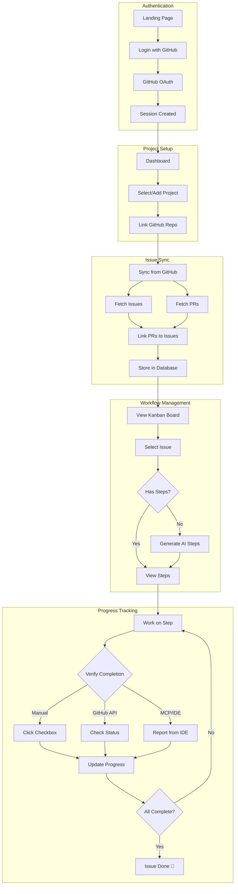

---

## 2. Data Model Relationships

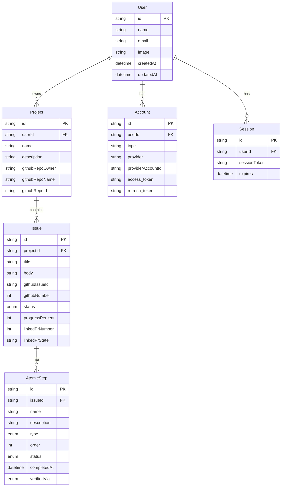

---

## 3. Authentication Flow

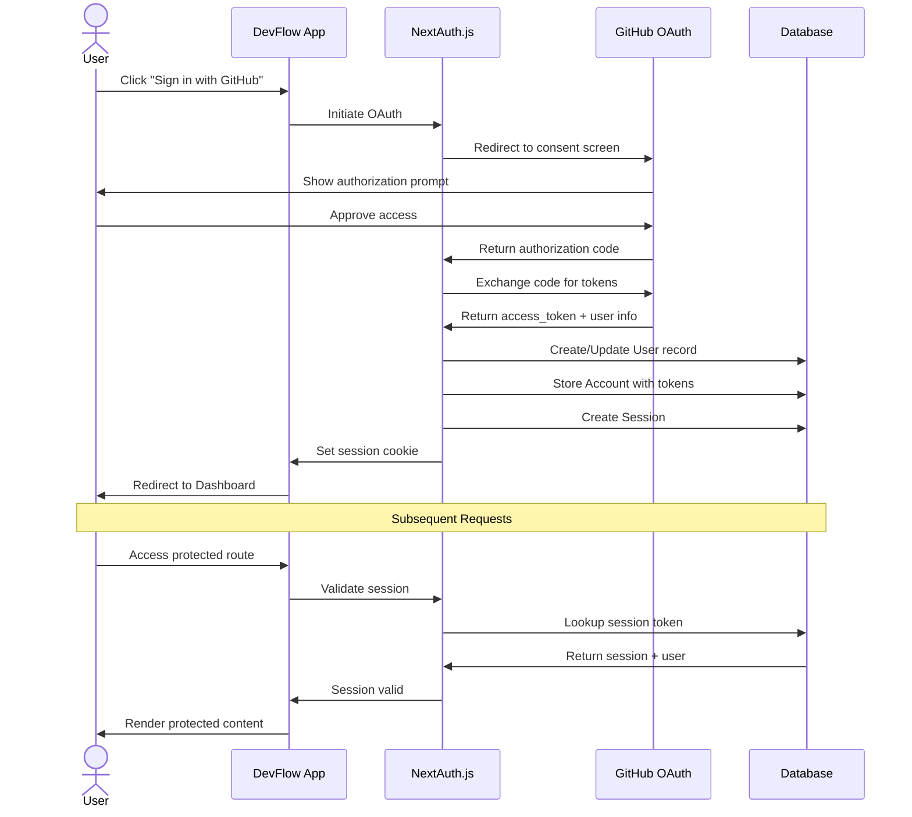

---

## 4. GitHub Sync Process

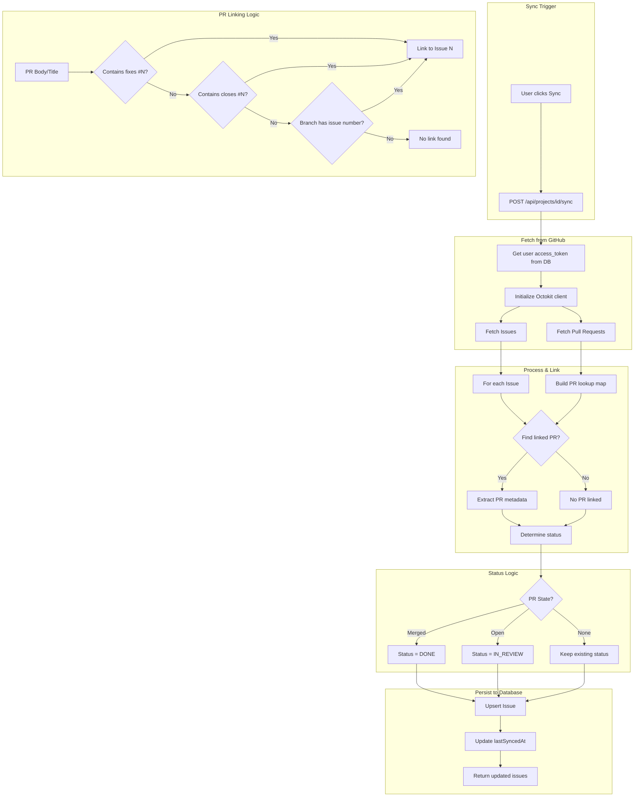

---

## 5. Step Verification Flow

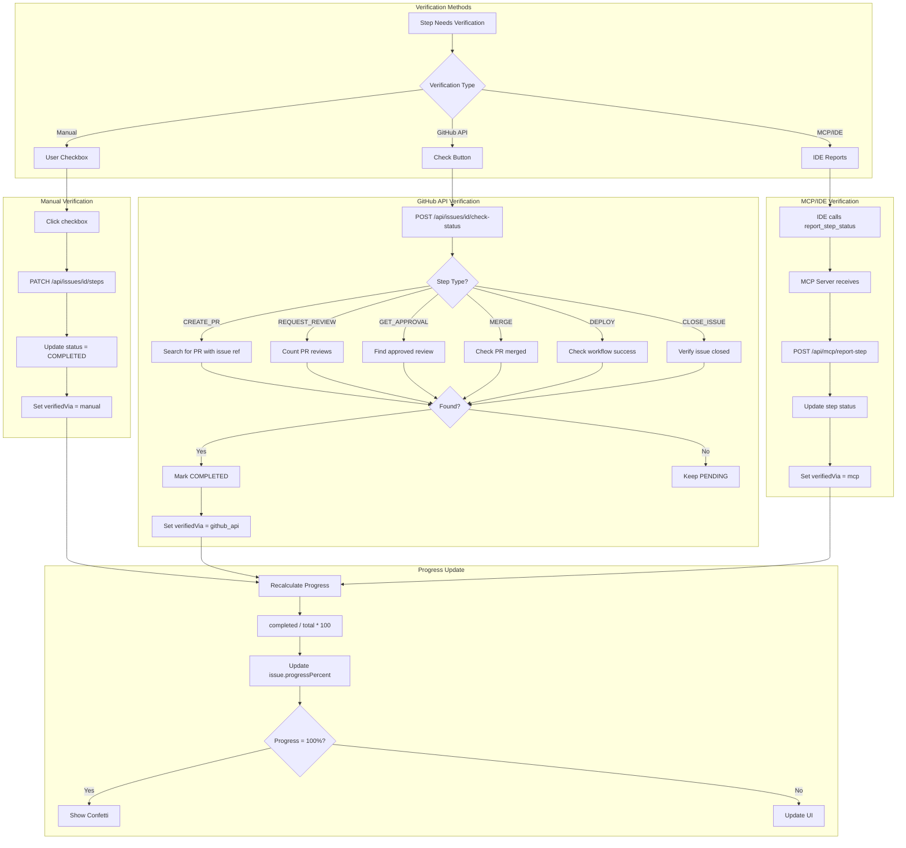

---

## 6. Component Hierarchy

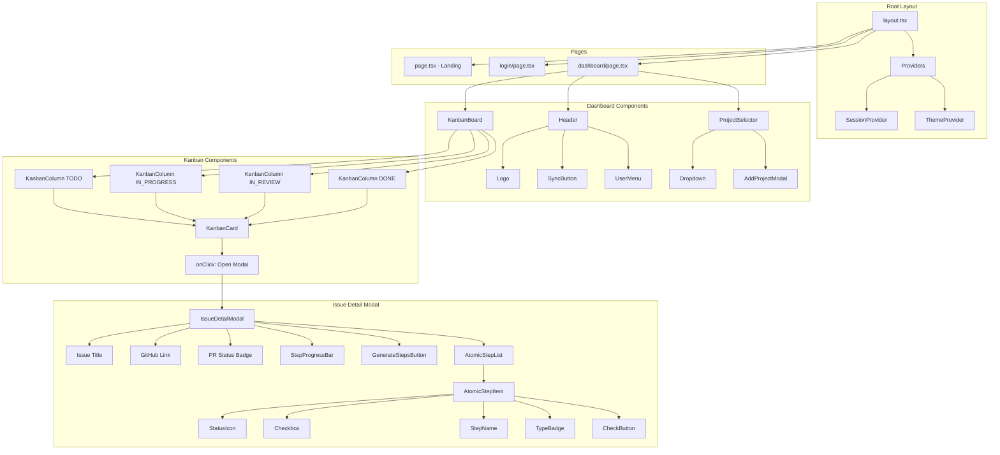

---

## 7. API Request Flow

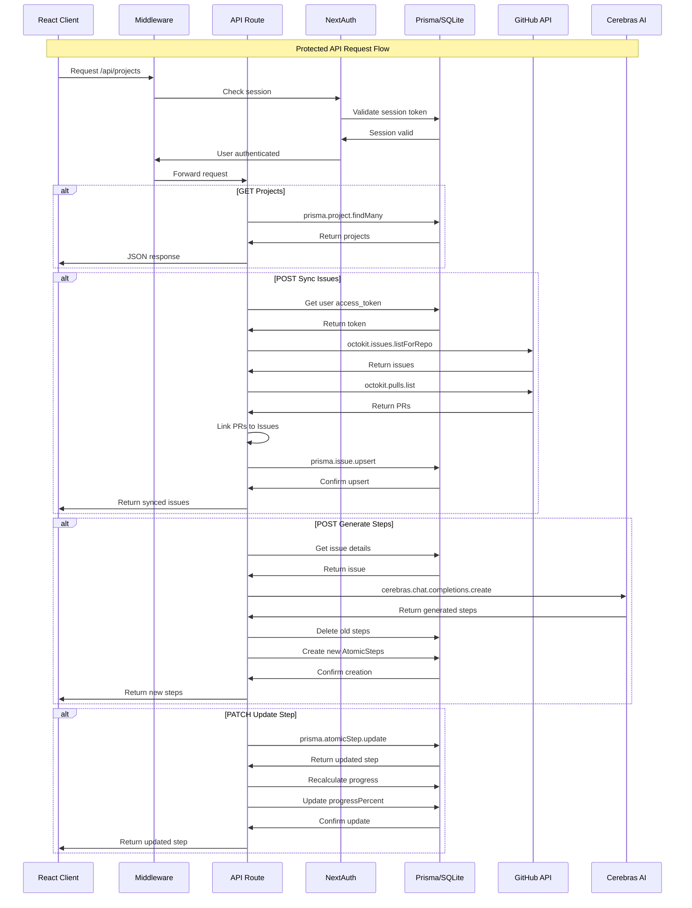

---

## 8. State Flow in Dashboard

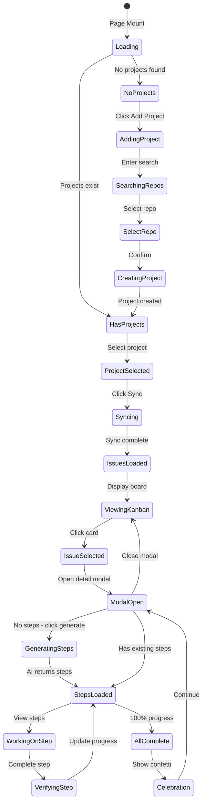

---

## 9. Database Query Flow

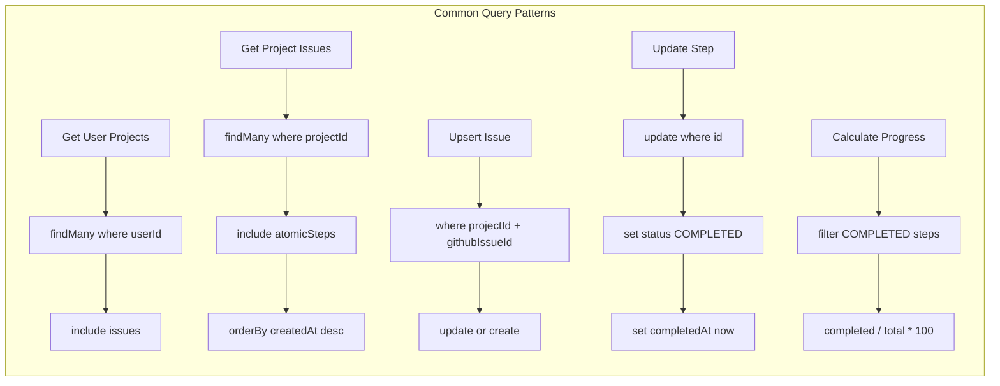

---

## 10. MCP Server Architecture

```mermaid
flowchart TB
    subgraph IDE["IDE Environment"]
        A[VS Code / Cursor]
        A --> B[MCP Client Extension]
    end

    subgraph MCP["MCP Server - stdio"]
        B <-->|JSON-RPC| C[mcp/server.ts]
        C --> D[Tool: report_step_status]
        C --> E[Tool: get_issue_steps]
        C --> F[Tool: list_active_issues]
    end

    subgraph API["DevFlow API"]
        D -->|POST| G[/api/mcp/report-step]
        E -->|GET| H[/api/mcp/issue-steps]
        F -->|GET| I[/api/mcp/active-issues]
    end

    subgraph DB["Database"]
        G --> J[(SQLite)]
        H --> J
        I --> J
    end

    subgraph Response["Response Flow"]
        J --> K[Query Results]
        K --> L[Format Response]
        L --> M[Return to IDE]
    end
```

---

## 11. Issue Status Transitions

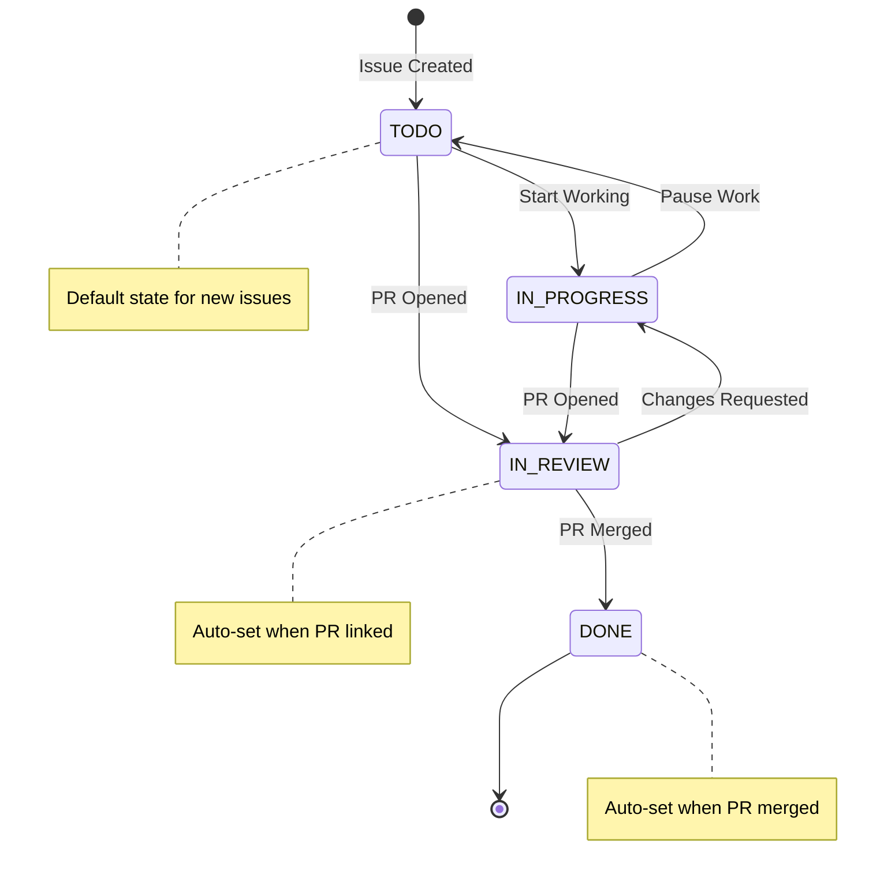

---

## 12. Step Types and Workflow

```mermaid
flowchart LR
    subgraph Development["Development Phase"]
        A[CODE] --> B[TEST]
        B --> C[RUN_TESTS]
    end

    subgraph Integration["Integration Phase"]
        C --> D[COMMIT]
        D --> E[CREATE_PR]
    end

    subgraph Review["Review Phase"]
        E --> F[REQUEST_REVIEW]
        F --> G[ADDRESS_COMMENTS]
        G --> H[GET_APPROVAL]
    end

    subgraph Completion["Completion Phase"]
        H --> I[MERGE]
        I --> J[DEPLOY]
        J --> K[CLOSE_ISSUE]
    end

    style A fill:#e1f5fe
    style B fill:#e1f5fe
    style C fill:#e1f5fe
    style D fill:#fff3e0
    style E fill:#fff3e0
    style F fill:#f3e5f5
    style G fill:#f3e5f5
    style H fill:#f3e5f5
    style I fill:#e8f5e9
    style J fill:#e8f5e9
    style K fill:#e8f5e9
```
