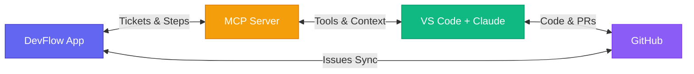
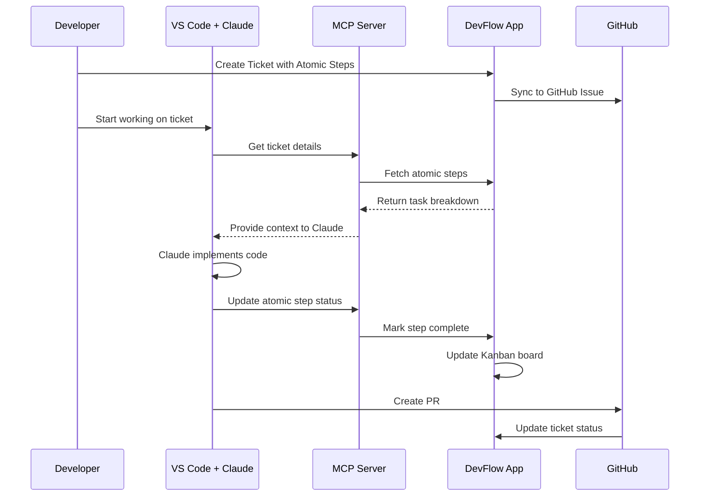

# DevFlow Architecture

## High-Level System Architecture

## Data Flow

## Key Integration Points

| Component | Role | Technology |
|-----------|------|------------|
| **DevFlow App** | Visual task management & Kanban | Next.js, React |
| **MCP Server** | AI-IDE bridge & tool provider | Model Context Protocol |
| **Claude Code** | AI pair programmer | Claude API |
| **GitHub** | Source control & issue tracking | GitHub API |
