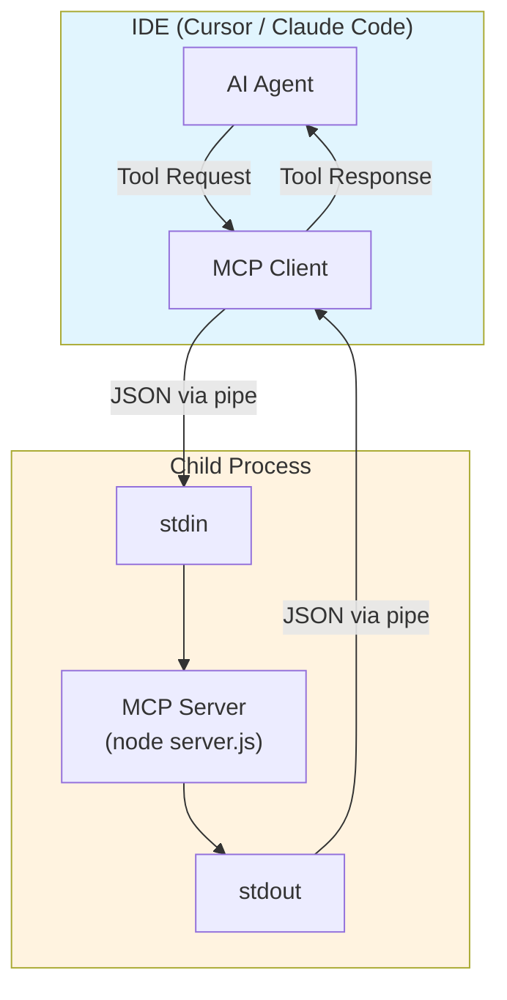
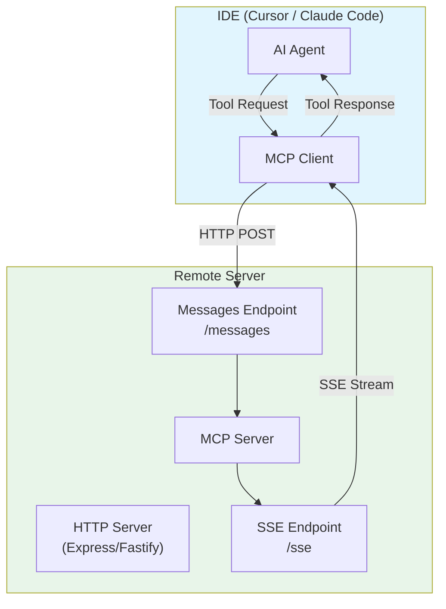
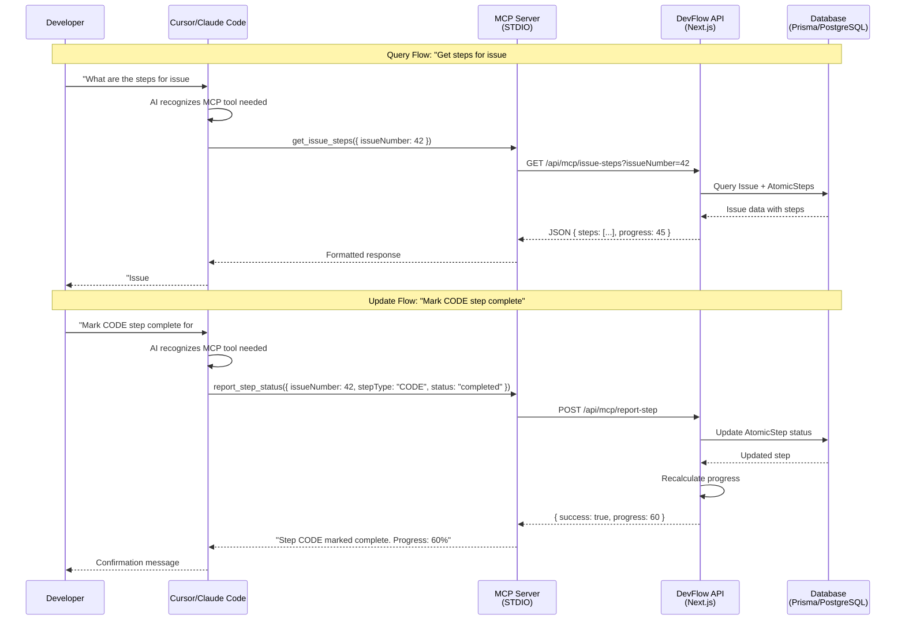
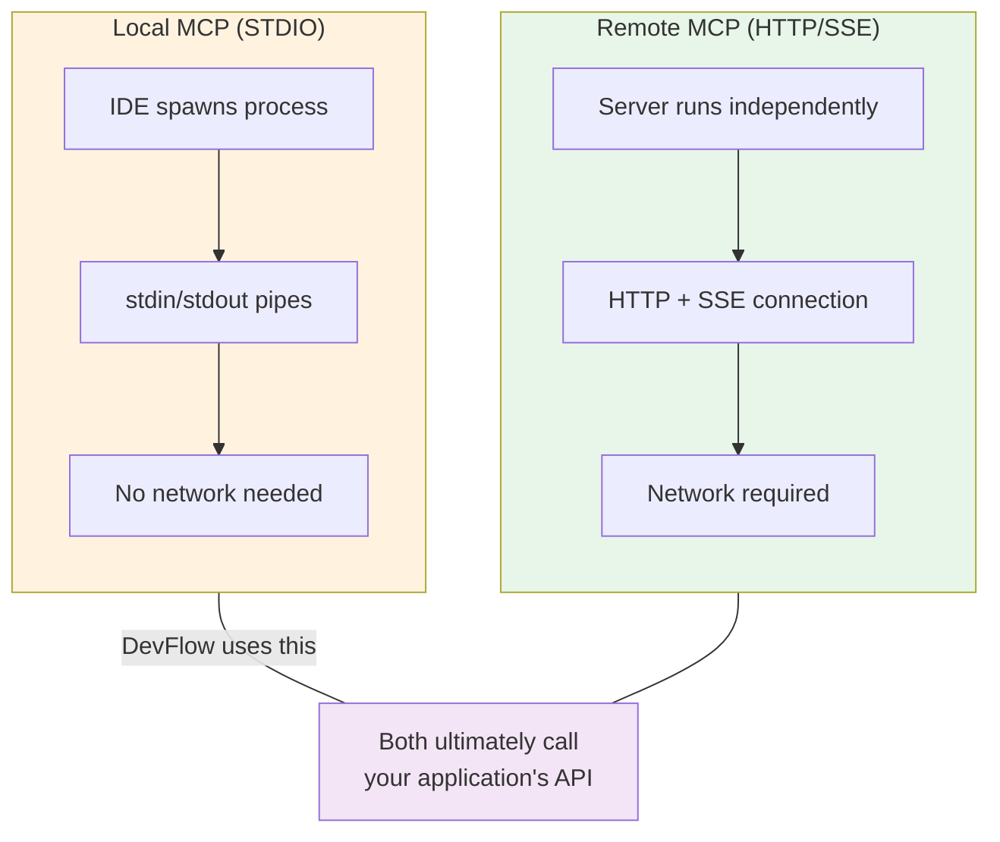

# MCP Communication Architecture

This document explains how Model Context Protocol (MCP) servers communicate with IDEs and applications.

## What is MCP?

MCP (Model Context Protocol) is a standard for connecting AI assistants to external tools and data sources. It allows IDEs like Cursor and Claude Code to interact with custom tools you define.

## Transport Types

MCP supports two main transport mechanisms:

| Transport | Use Case | Communication |
|-----------|----------|---------------|
| **STDIO** | Local development | Process pipes (stdin/stdout) |
| **SSE/HTTP** | Remote/hosted servers | HTTP requests + Server-Sent Events |

---

## 1. Local MCP (STDIO Transport)

This is what DevFlow uses. The IDE spawns the MCP server as a child process and communicates through standard input/output pipes.

### Architecture



### How It Works

1. **IDE starts**: Reads MCP config and spawns child processes for each server
2. **Process created**: `node /path/to/mcp/dist/server.js` runs as a child process
3. **Communication**: IDE writes JSON to stdin, reads JSON from stdout
4. **Lifecycle**: Process lives as long as the IDE session

### Configuration

```json
{
  "mcpServers": {
    "devflow": {
      "command": "node",
      "args": ["/path/to/devflow/mcp/dist/server.js"],
      "env": {
        "DEVFLOW_API_URL": "http://localhost:3000"
      }
    }
  }
}
```

### Pros & Cons

| Pros | Cons |
|------|------|
| Simple setup | Local only |
| No network config | Must rebuild after changes |
| No authentication needed | One instance per IDE |
| Fast (no network latency) | Can't share across machines |

---

## 2. Remote MCP (HTTP/SSE Transport)

For hosted MCP servers that can be accessed over the network. Uses HTTP for requests and Server-Sent Events (SSE) for streaming responses.

### Architecture



### How It Works

1. **Server runs independently**: Hosted on a URL (e.g., `https://mcp.devflow.io`)
2. **IDE connects**: Establishes SSE connection for receiving messages
3. **Requests via HTTP**: Tool calls sent as POST requests to `/messages`
4. **Responses via SSE**: Results streamed back through the SSE connection

### Configuration

```json
{
  "mcpServers": {
    "devflow": {
      "url": "https://mcp.devflow.io/sse"
    }
  }
}
```

### Server Code Example

```typescript
import { SSEServerTransport } from "@modelcontextprotocol/sdk/server/sse.js";
import express from "express";

const app = express();

app.get("/sse", (req, res) => {
  const transport = new SSEServerTransport("/messages", res);
  server.connect(transport);
});

app.post("/messages", async (req, res) => {
  // Handle incoming MCP messages
  await transport.handlePostMessage(req, res);
});

app.listen(4059);
```

### Pros & Cons

| Pros | Cons |
|------|------|
| Accessible from anywhere | Requires hosting |
| Shared across team/machines | Network latency |
| Can scale independently | Needs authentication |
| Hot-reload friendly | More complex setup |

---

## 3. DevFlow Data Flow

This diagram shows how data flows through the DevFlow system when an AI agent in Cursor/Claude Code interacts with issues.

### Complete Request Flow



### Component Responsibilities

```mermaid
flowchart LR
    subgraph IDE["IDE Layer"]
        Agent["AI Agent<br/>Interprets user intent"]
        Client["MCP Client<br/>Manages tool calls"]
    end

    subgraph MCP["MCP Layer"]
        Server["MCP Server<br/>Defines tools & schemas"]
        Transform["Data Transform<br/>Format responses"]
    end

    subgraph App["Application Layer"]
        Routes["API Routes<br/>/api/mcp/*"]
        Logic["Business Logic<br/>Validation & Processing"]
    end

    subgraph Data["Data Layer"]
        Prisma["Prisma ORM"]
        PG["PostgreSQL"]
    end

    Agent --> Client
    Client --> Server
    Server --> Transform
    Transform --> Routes
    Routes --> Logic
    Logic --> Prisma
    Prisma --> PG

    style IDE fill:#e1f5fe
    style MCP fill:#fff3e0
    style App fill:#e8f5e9
    style Data fill:#fce4ec
```



### Available MCP Tools

| Tool | Direction | API Endpoint | Purpose |
|------|-----------|--------------|---------|
| `get_issue_steps` | Read | `GET /api/mcp/issue-steps` | Fetch steps for an issue |
| `list_active_issues` | Read | `GET /api/mcp/active-issues` | List in-progress issues |
| `report_step_status` | Write | `POST /api/mcp/report-step` | Update step completion |
| `create_feature_branch` | Read | `GET /api/mcp/suggest-branch` | Get branch name suggestion |

---

## Key Differences Summary



## Further Reading

- [MCP Specification](https://modelcontextprotocol.io/)
- [DevFlow MCP Server README](../mcp/README.md)
